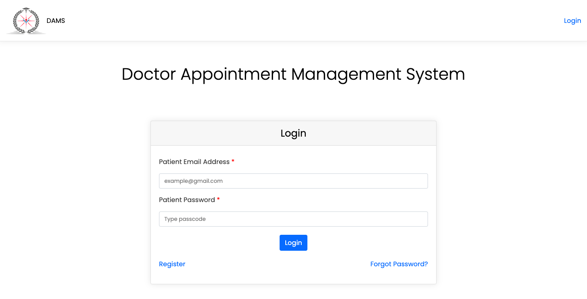
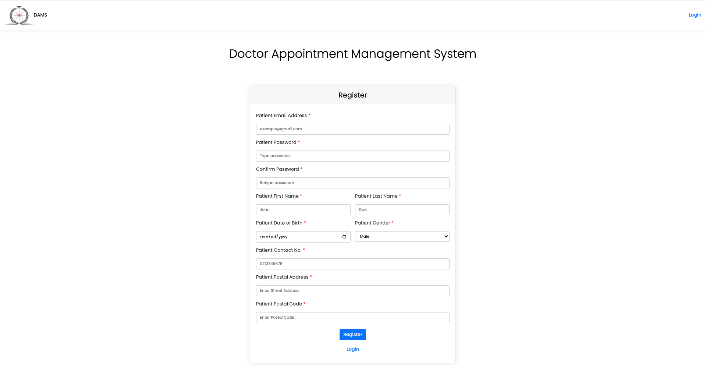
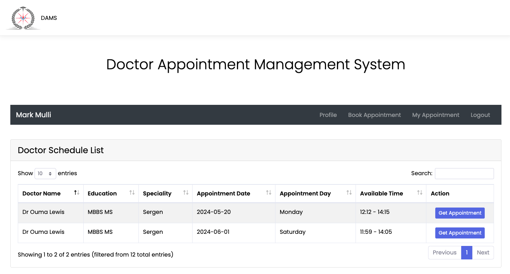
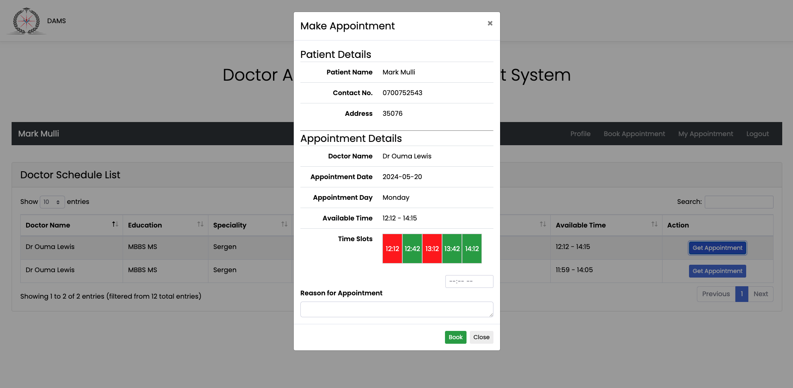
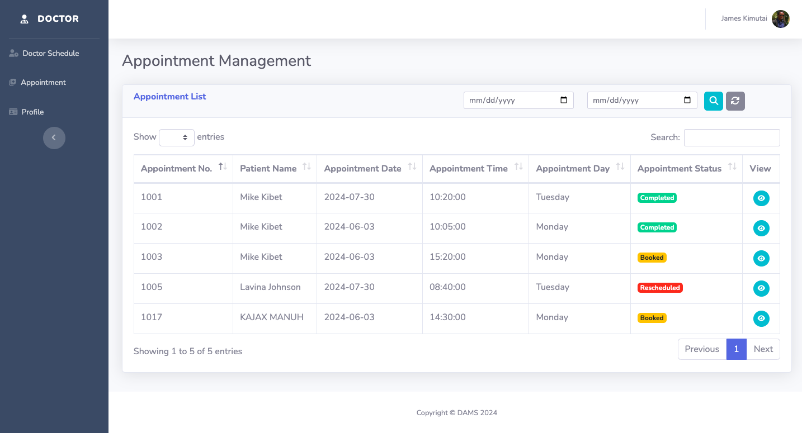
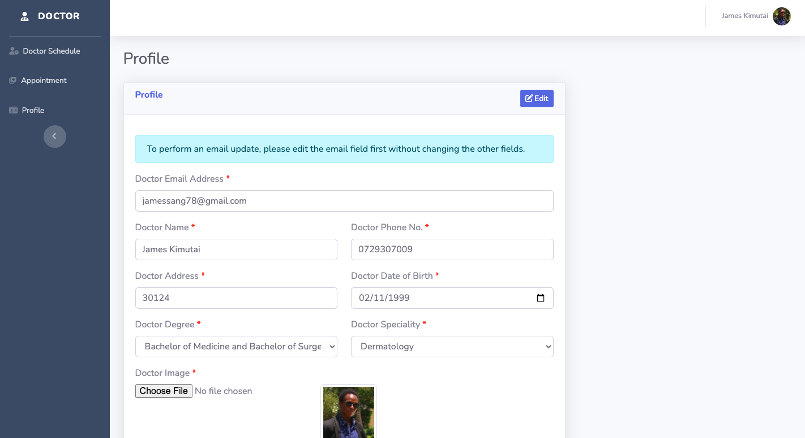
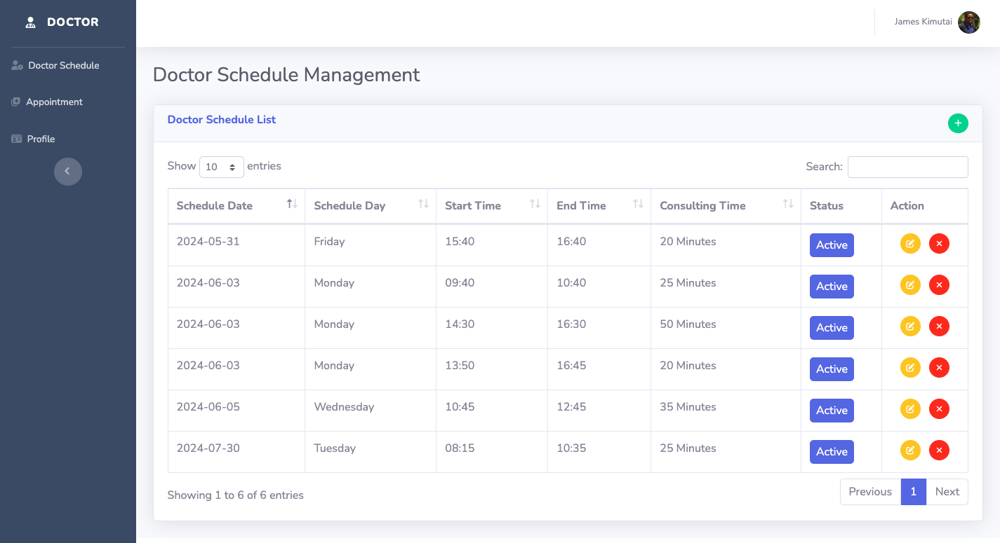
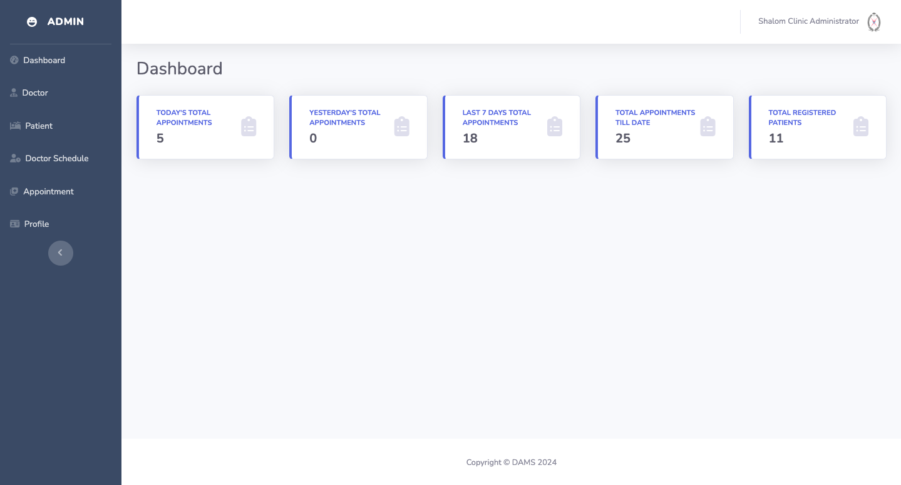
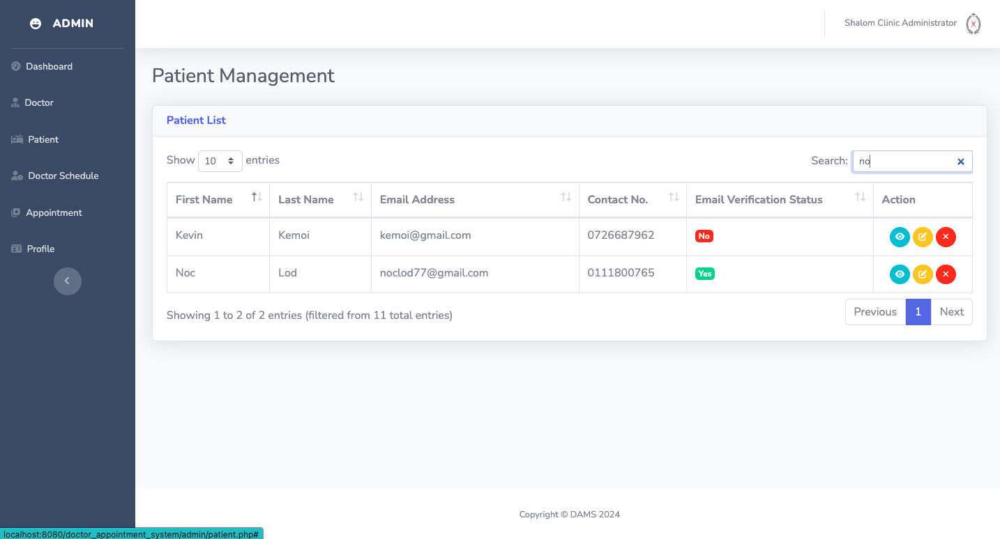
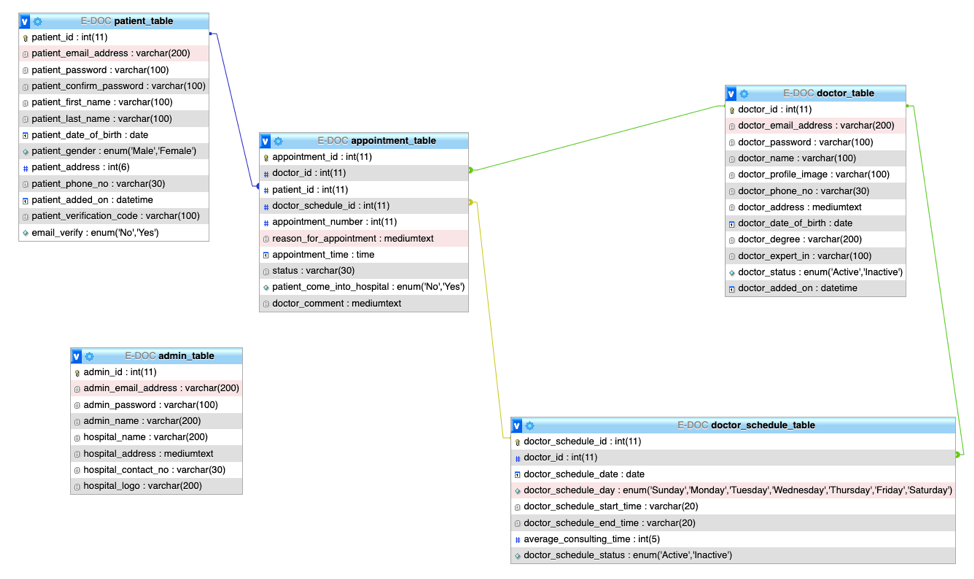

# Doctor Appointment Management System

*A PHP web based application.*

This web app allows registered users to schedule appointments with a list of available doctors efficiently at their convenient or preffered time.

## Table of Contents

1. [Running Locally on Localhost](#running-locally-on-localhost)
1. [Tech Stack](#tech-stack)
1. [Mockups](#mockups)

## Running Locally on Localhost

1. Ensure that you have installed `XAMPP` or `WAMP` in your machine.
1. Clone this repo or download the zip file.
1. Move the cloned or downloaded project inside the `XAMPP` directory.

## Tech Stack

### Front End

1. HTML
1. CSS
1. JAVASCRIPT
1. Ajax and JQuery

### Back End

1. PHP

### Database 

1. MySQL

## Mockups
### Home Page

  

### Login Page

  

### Register Page

  

### Patient Dashboard Page

  

### Patient Booking Section

  

### Doctor Appointments Page

  

### Doctor Profile Page

  

### Doctor Schedule Page

  

### Admin Dashboard Page

  

### Patient Records Page

  

### Admin Profile Page

  

## Database Schema

  

